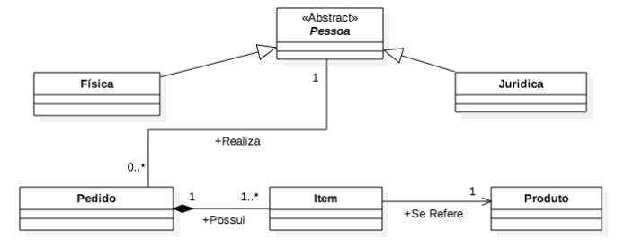
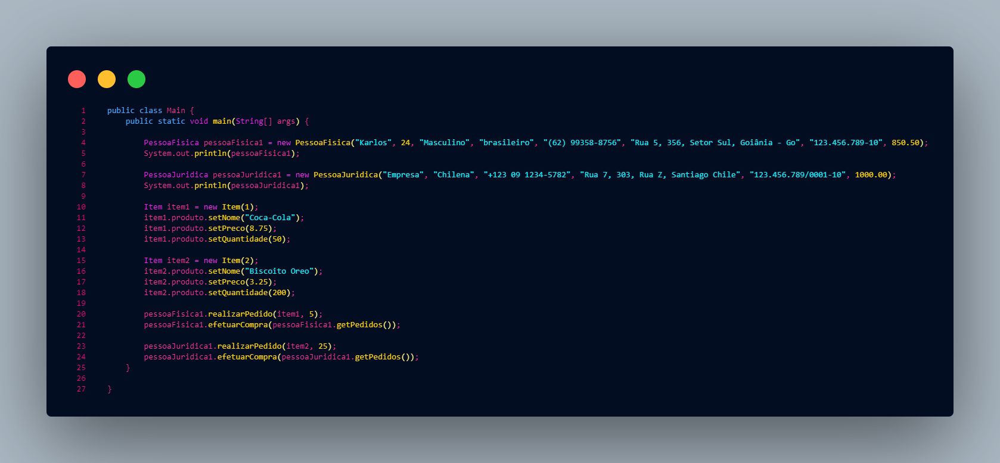
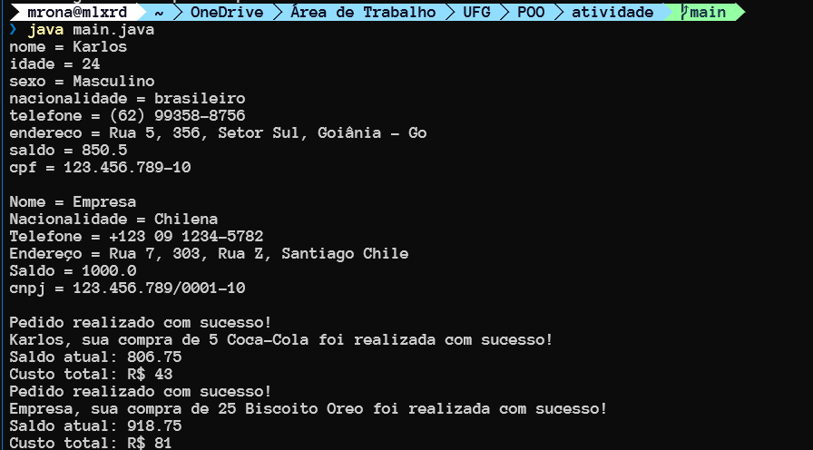

<h1>Documentação de atividade</h1>

<h2>Atividade de associação, herança e polimorfismo em Java</h2>

<h2>Autor - discente: Marcello Ronald</h2>
<h3> Resumo </h3>
<p>
    Atividade desenvolvida a partir de um diagrama de classes que visa
    a prática de associação, herança e polimorfismo numa dada aplicação Java
    a aplicação simula uma dada pessoa realizando um ato de compra
</p>
<h3> Descrição </h3>
<p> 
A partir de uma classe abstrata <b>PESSOA</b> duas classes filhas são criadas
<i>Pessoa Física</i> e <i>Pessoa jurídica</i>, essas duas classes herdam os atributos de pessoa e apartir disso dispõem-se de métodos e atributos próprios, Os métodos e atributos da atividade foram definidas pelo autor.
A Classe pessoa deve poder realizar um pedido, esse pedido possui um item e este item se refere à um produto
</p>

<h3>Diagrama</h3>
<p align="center">
  
</p>

<h2>Tópicos</h2>
<ol>
    <li><a href="#cliente">Pacote - Cliente</a></li>
    <li><a href="#logistica">Pacote - Logistica</a></li>
    <li><a href="#main">Main - Execução</a></li>
    <li><a href="#final">Exemplo de Execução</a></li>
</ol>
<h2 id="cliente">Pacote - Cliente</h2>
<p>
    O pacote Cliente, possui as classes referentes ao cliente, sendo eles:
    #Pessoa.java
    #PessoaFisica.java
    #PessoaJuridica.java
</p>
<h3>Classe Pessoa</h3>
<h4>Atributos</h4>

```
java
    private String nome;
    private int idade;
    private String sexo;
    private String nacionalidade;
    private String telefone;
    private String endereco;
    private double saldo;
    private Produto pedidos[] = new Produto[10];
```

<p>
    Esses atributos são comuns a todas as classes filhas, sendo que a classe pessoa é abstrata e não pode ser instanciada diretamente<br>
    Todos os atributos são privados e possuem métodos de acesso e modificação, a maioria dos
    atributos listados são de identificação, com excessão de saldo e do atributo pedidos
    O saldo diz respeito ao dinheiro que a pessoa possui, e o atributo pedidos é um vetor de produtos, esse vetor é utilizado para armazenar os produtos que a pessoa deseja comprar
    no caso 10 é uma quantia representativa, mas pode ser alterada para um valor maior ou menor
</p>

<p>
    Após a definição dos atributos, é criado o constructor de Pessoa, no código em questão é criado dois constructores, um referente a Pessoa Física, e o outro referente a Pessoa Jurídica<br>
    Constructor para Pessoa Física  
    
    java
        public Pessoa(String nome, int idade, String sexo, String nacionalidade, String telefone, String endereco, double saldo) {
            this.nome = nome;
            this.idade = idade;
            this.sexo = sexo;
            this.nacionalidade = nacionalidade;
            this.telefone = telefone;
            this.endereco = endereco;
            this.saldo = saldo;
        }
        
Construtor para Pessoa Juridica
    
    java
        public Pessoa(String nome, String nacionalidade, String telefone, String endereco, double saldo) {
        this.nome = nome;
        this.nacionalidade = nacionalidade;
        this.telefone = telefone;
        this.endereco = endereco;
        this.saldo = saldo;
    }
</p>
Eles são muito similares, a única diferença nótavel é que o constructor de Pessoa Juridica não tem sexo.
<h3>Getters e Setters</h3>
<p>
    Para cada Atributo é criado um Getter e um Setter, assim permite que cada atributo seja modificado através de um setter e seja consultado através de um Getter.
</p>

<p>A Classe Pessoa possui dois métodos especiais referentes a compra, que são o de <b>Realizar o Pedido</b> e o de <b>Efetuar Compra</b> em si. Cada um desses métodos será melhor detalhado na parte de Execução, mas de maneira resumida, o método de realizar pedido adiciona algum dado item, numa quantidade X, ao possivel carrinho da pessoa, e o efetuar compra, faz a compra dos produtos adicionados.</p>

<h3>função de realizarPedido:</h3>

```
public void realizarPedido(Item item, int quantidade){
       
        //verificar se a quantidade é válida
        if(quantidade <= item.produto.getQuantidade()){
            System.out.println("Pedido realizado com sucesso!");
            pedidos[quantidadeP] = item.produto;
            pedidos[quantidadeP].setQuantidade(quantidade);
            quantidadeP++;
        }else {
            System.out.println("\n");
            System.out.println("Quantidade inválida!");
        }
    }
```
<h3>função de efetuarCompra:</h3>

```
 public void efetuarCompra(Produto pedidos[]){
        int custoTotal = 0;
        if(pedidos.length > 0){
            for(int i = 0; i < quantidadeP; i++){
                if(pedidos[i].getQuantidade() > 0 && saldo >= pedidos[i].getQuantidade() * pedidos[i].getPreco()){
                    saldo -= pedidos[i].getPreco() * pedidos[i].getQuantidade();
                    System.out.println(nome + ", sua compra de " + pedidos[i].getQuantidade() + " " + pedidos[i].getNome() +  " foi realizada com sucesso!\nSaldo atual: " + saldo);
                    custoTotal += pedidos[i].getPreco() * pedidos[i].getQuantidade();
                    pedidos[i].setQuantidade(0);
                }else{
                    System.out.println("Produto esgotado! Ou saldo Insuficiente");
                    return;
                }
            }
            System.out.println("Custo total: R$ " + custoTotal);
        }else{
            System.out.println("Nenhum pedido realizado!");
        }
    }
```

<h3>Classe PessoaJuridica</h3>
<p>A classe PessoaJuridica é uma classe filha de Pessoa, e como tal herda seus atributos e métodos.</p>
<h4>Constructor</h4>

```
    public PessoaJuridica(String nome, String nacionalidade, String telefone, String endereco, String cnpj, double saldo) {
            super(nome, nacionalidade, telefone, endereco, saldo);
            this.cnpj = cnpj;
        }
```

<p>A pessoa Juridica é em essência uma "Pessoa" com cnpj.</p>

<h3>Classe PessoaFisica</h3>
<p>A classe da PessoaFisica também segue a mesma lógica da PessoaJuridica, ela é uma classe filha de Pessoa, mas possui CPF</p>
<h4>Constructor</h4>

```
public PessoaFisica(String nome, int idade, String sexo, String nacionalidade, String telefone, String endereco, String cpf, double saldo) {
        super(nome, idade, sexo, nacionalidade, telefone, endereco, saldo);
        this.cpf = cpf;
    }
```

<h2 id="logistica">Pacote - Logistica</h2>
<p>
    <ul>
        <li>Classe - Produto</li>
        <li>Classe - Item</li>
    </ul>
</p>
<h2>Item</h2>
<p>
    A classe de item descreve um item génerico, que é gerado a partir de um ID único.
    ```
    
    java
        public class Item {
        private int id;
        
        public Item(int id) {
            this.id = id;
        }
        
        public int getId() {
            return id;
        }
        
        public void setId(int id) {
            this.id = id;
        }
        public Produto produto = new Produto("Produto", 0.0, 0);
        }

A classe é relativamente simples, ela tem um atributo único que se caracteriza pelo ID do produto, e possui uma associação de produto que é também uma classe<br>Cada vez que um Item é instanciado ele automaticamente cria uma intância de Produto, e alguns valores padrões são passados como padrão.
</p>
<h2>Produto</h2>
<p>
    A classe Produto é mais complexa e carrega mais atributo do que o item por si só,
    
    java
        private String nome;
        private double preco;
        private int quantidade;
    
Constructor: 
    
    public Produto(String nome, double preco, int quantidade) {
        this.nome = nome;
        this.preco = preco;
        this.quantidade = quantidade;
    }

Este é o construtor da classe Produto, para este exercício foram considerados estes três atributos.

<h2 id="main">Execução</h2>
<p>
    A execução do programa é relativamente simples, primeiro cada Pessoa é instanciada a partir da sua respectiva classe:
</p>
<h3>Pessoa Física</h3>

    public class Main {
        public static void main(String[] args) {

        PessoaFisica pessoaFisica1 = new PessoaFisica("Karlos", 24, "Masculino", "brasileiro", "(62) 99358-8756", "Rua 5, 356, Setor Sul, Goiânia - Go", "123.456.789-10", 850.50);
        System.out.println(pessoaFisica1);

<p>Neste Exemplo temos uma pessoa Chamada Karlos, ele é atribuído à uma variavél "pessoaFisica1", com as atributos passados no momento da sua iniciação.</p>
<br>
<h3>Pessoa Jurídica</h3>

    PessoaJuridica pessoaJuridica1 = new PessoaJuridica("Empresa Fícticia", "Chilena", "+123 09 1234-5782", "Rua 7, 303, Rua Z, Santiago Chile", "123.456.789/0001-10", 1000.00);
        System.out.println(pessoaJuridica1);
        
<p>
    A atribuição da pessoaJuridica é semelhante a de pessoaFisica, muda apenas que ao invés de passar um cpf, passamos um cnpj, e omitimos o atributo sexo, é notável também que cada um possui saldo como atributo, este saldo é o que será considerado na compra dos produtos
</p>
<h3>Usando métodos de compra e realização de pedido</h3>
<h4>Definindo O Item</h4>

    Item item1 = new Item(1);
    item1.produto.setNome("Coca-Cola");
    item1.produto.setPreco(8.75);
    item1.produto.setQuantidade(50);
        
<p>
    No código acima definimos uma instância de Item, e passamo o ID "1" para ele, após Isto nós definimos os dados bases de um produto, no exemplo passado, eu nome-ei um produto como "Coca-cola", defini um preço, e setei uma quantidade de 50, no Estoque fícticio da situação.
</p>

<h4>Método de realização do pedido</h4> 

   public void realizarPedido(Item item, int quantidade){
       
        //verificar se a quantidade é válida
        if(quantidade <= item.produto.getQuantidade()){
            System.out.println("Pedido realizado com sucesso!");
            pedidos[quantidadeP] = item.produto;
            pedidos[quantidadeP].setQuantidade(quantidade);
            quantidadeP++;
        }else {
            System.out.println("\n");
            System.out.println("Quantidade inválida!");
        }
    }
    

Como já mostrado anteriormente nesta mesma documentação, o código de realizar pedido admite como parâmetro um item e uma quantidade X, ele então faz uma verificação para saber se a quantidade pedida existe no "estoque" e então a quantidade pedida do produto passado (por meio do Id) é adicionada a instância da pessoa que está realizando o pedido (Na 4° linha de código: pedidos[quantidadeP].setQuantidade(quantidade); o que ocorre é que setamos a quantidade do produto no array linkado ao usuário com base no que é passado na função ), neste caso:

    pessoaFisica1.realizarPedido(item1, 5);

5 Cocas colas são adicionadas ao "carrinho" da PessoaFisica1, que é o Karlos

<h4>Método efetuar compra</h4>

      public void efetuarCompra(Produto pedidos[]){
        int custoTotal = 0;
        if(pedidos.length > 0){
            for(int i = 0; i < quantidadeP; i++){
                if(pedidos[i].getQuantidade() > 0 && saldo >= pedidos[i].getQuantidade() * pedidos[i].getPreco()){
                    saldo -= pedidos[i].getPreco() * pedidos[i].getQuantidade();
                    System.out.println(nome + ", sua compra de " + pedidos[i].getQuantidade() + " " + pedidos[i].getNome() +  " foi realizada com sucesso!\nSaldo atual: " + saldo);
                    custoTotal += pedidos[i].getPreco() * pedidos[i].getQuantidade();
                    pedidos[i].setQuantidade(0);
                }else{
                    System.out.println("Produto esgotado! Ou saldo Insuficiente");
                    return;
                }
            }
            System.out.println("Custo total: R$ " + custoTotal);
        }else{
            System.out.println("Nenhum pedido realizado!");
        }
    }

O método de efetuar compra também já foi mostrado, mas em síntese ele admite um array de pedidos, ele então verifica se há de fato algum pedido realizado, após isto ele entra num loop onde percorre os produtos pedidos linkados a Pessoa que pediu<br>
Observe que é O produto com nome, preço e quantidade, então seria algo assim:
| Produto1 | Produto2 |
| -------- | -------- |
| Nome: Coca-Cola | ... |
| Preco: 8.75 | ... |
| Quantidade: 50 | ... |
Ele percorre cada produto nessa lista, (Antes ele checa se o array é válido, se não for ele exibe a mensagem dizendo que nenhum pedido foi realizado) e então para cada produto checa duas coisas
<ol>
    <li>Se a quantidade é válida, ou seja maior do que 0</li>
    <li>Se a pessoa tem saldo para efetuar de fato a compra</li>
</ol>
Se nenhum dos casos é atendito ele exibe a mensagem: "Produto esgotado! Ou saldo Insuficiente"
A cada iteração ele exibe a mensagem: "Nome sua compra de X pedidos foi realizada com sucesso! Saldo atual: X.X"
E quando termina o laço ele exibe o preço total da compra.

<h2 id="teste">Exemplo de Teste</h2>
<p align="center">
  
  
</p>


